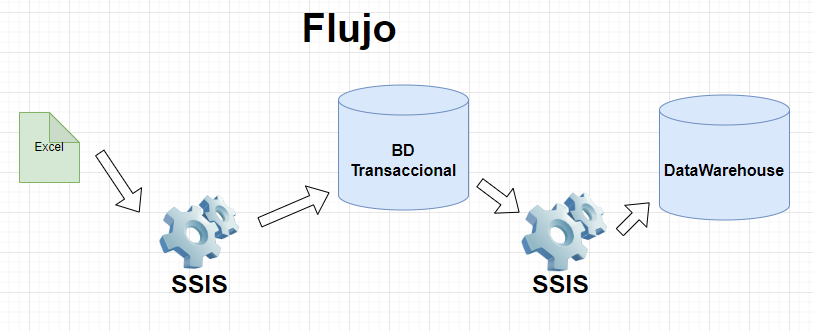
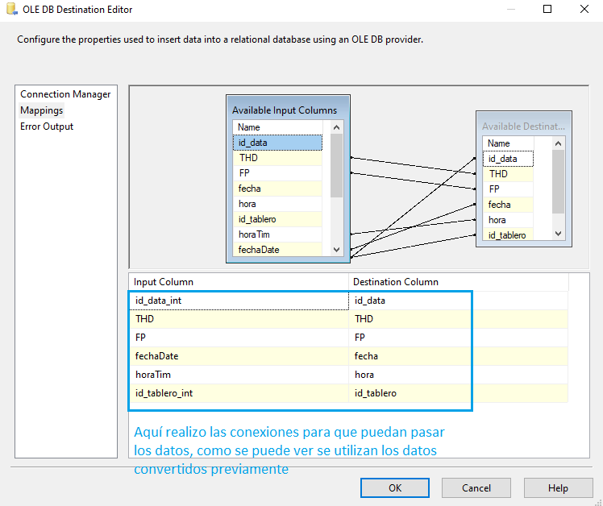

# Carga incremental con tipos de datos de fecha

**Objetivo:**
Esta es una manera de poder hacer dinámica la forma en que cargamos los datos de un excel, trabajando con datos de tipo fecha y hora a una base de datos. 

**Mejores Prácticas:**
Una mejor práctica es considerar 2 bases de datos, la base de datos transaccional(donde ocurren las transacciones diarias) y la base de datos de análisis (puede ser el Datawarehouse, los datos históricos)
el flujo quedaría así

### **Caso Práctico**

Este es mi archivo de Excel (lo vuelvo una tabla)

Lo tengo que pasar a una base de datos, entonces modelo y creo la base de datos en SQL SERVER a usar, en este caso los datos que quiero pasar son los de la tabla Data_Electrica

Creo mi proyecto normal en visual studio con Integration Services
coloco el objeto contenedor y luego otro objeto tarea de flujo de datos

#### **1. Configuración del primer objeto(Origen de Excel)**
Entro dando click al objeto Tarea de flujo de datos(esto es todo el flujo construído), pero iremos por pasos, primero seleccionamos el origen de Excel, que es nuestro archivo que tiene la data

luego configuramos  ese objeto(realizamos la conexión brindando la dirección de origen del archivo excel) y luego seleccionamos la tabla(el nombre de la hoja)

luego en la pestaña columns veremos los encabezados de nuestro archivo excel

eso sería todo para la configuración del origen de datos Excel.

#### **2. Configuración del segundo objeto (Conversión de datos)**
Esto es importante entender que excel no define el tipo de dato, sólo le da un formato para la visualización, entonces al tratar de pasar los datos a una base de datos, si tenemos que definir que tipos de datos son, por eso hacemos esta conversión de acuerdo a nuestra estructura de la base de datos(considero los tipos de datos de mi tabla Data_Electrica).

#### **3. Configuración del tercer objeto (Búsqueda o lookup)**
Aquí tengo que realizar la conexión a la base de datos en la cual está mi tabla a la que se insertarán los datos. Luego selecciono la tabla a la que irán los datos

luego en la pestaña columns, se vincula con la llave primaria

con eso terminamos la configuración del tercer objeto

#### **4. Configuración del cuarto objeto(Destino de OLE DB)**

Hacemos click en Destino de OLE DB para seleccionar la conexión y la tabla de nuestra base de datos

Mapeamos nuestro campos para pasar los datos

De esta manera tenemos la configuración para los datos nuevos que se ingresen en la base de datos

#### **5. Configuración del quinto objeto (División condicional)**

realizo la configuración y aquí tengo que comparar los datos para ver cuales fueron modificados, entonces se compara cada campo

mi sentencia

comparo mis datos convertidos, en este caso fecha y hora, le hice dos conversiones, una para la base de datos con sus tipos originales de time y de date y otros para la insercción, que son de tipos strings los comparo con los alias que configuramos del buscador(los que están de color celeste)

#### **6. Configuración del sexto objeto (Comando de OLE DB )** 
conecto con el objeto que me va permitir actualizar los datos que sean diferentes

Aquí realizo la conexión

en la otra pestaña, es donde voy a ejecutar mi consulta de actualización

mi consulta (el "?" es el parámetro)

estos parámetros lo vemos en la siguiente pestaña "Column mappings"

como se puede ver el id_data_int es el último parámetro porque así está en nuestra consulta de actualización. Esa sería toda nuestra configuración, luego sólo se tendría que correr el programa

Y podemos verificar en la base de datos que tenemos, Es importante considerar que como nuestra tabla Data_Electrica es nuestra tabla principal(hechos) y contiene llaves foraneas tanto como de Tablero y de Cliente, primero hice la inserción manual de registros en ambas tablas (Tablero y de Cliente), para no tener problemas, pero de igual forma con integration services se puede realizar la carga masiva de los datos de estas tablas, pero mi  objetivo fue trabajar con una sola tabla y con la carga incremental de datos tipo fecha y hora.

**Consideraciones:**

para las nuevas conexiones si se utiliza visual estudio 2022, la conexión con native client ya no es valida 

Por eso las conexiones las realizo con Microsoft OLE DB Provider for SQL Server

